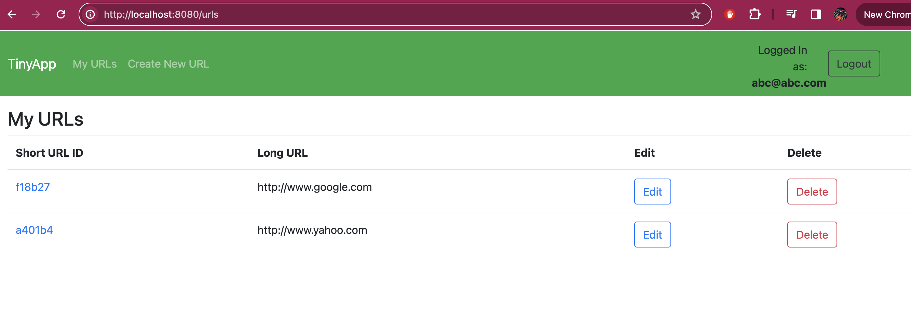
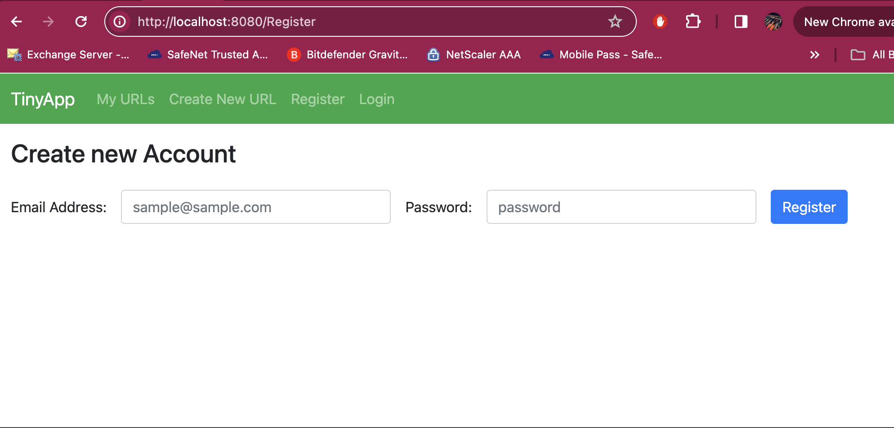
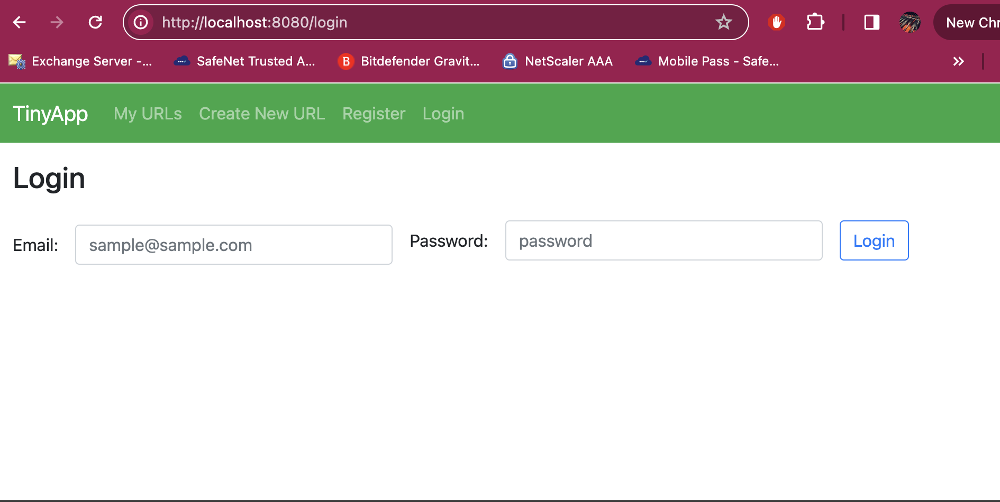
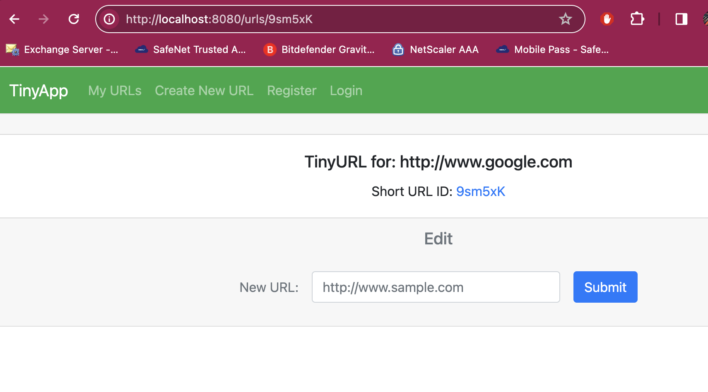
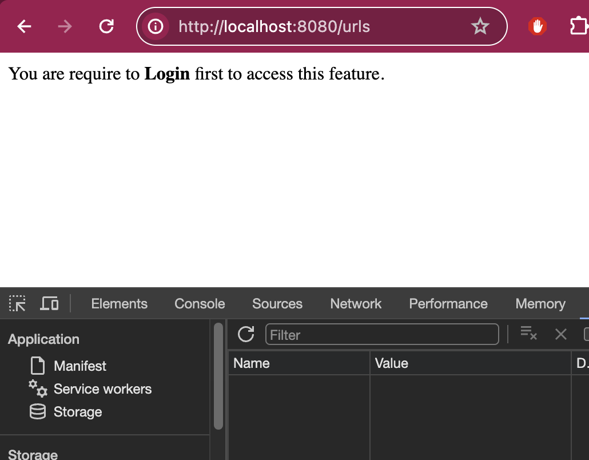
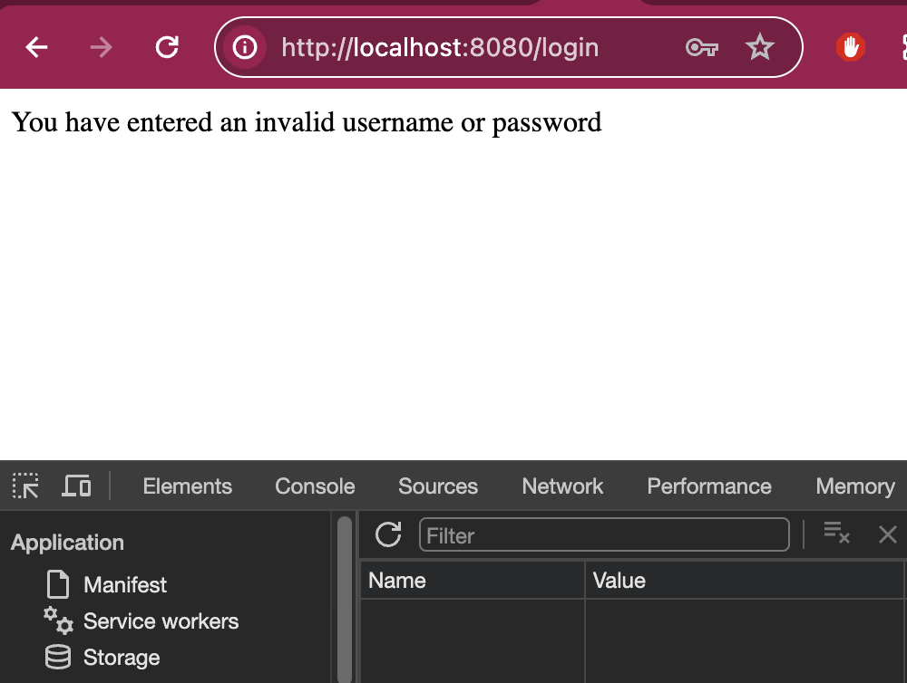
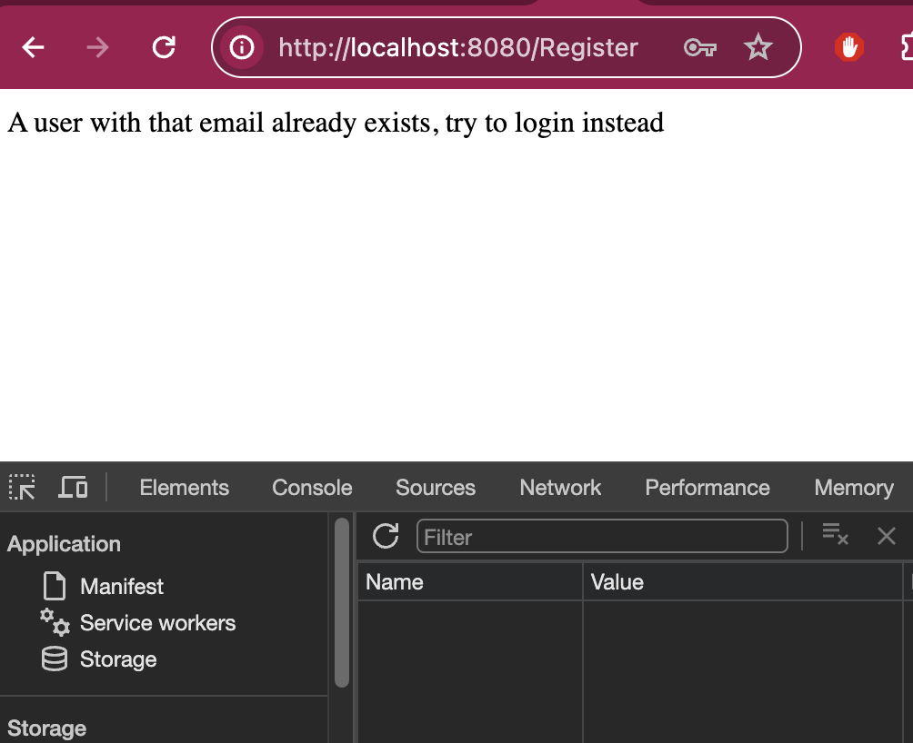
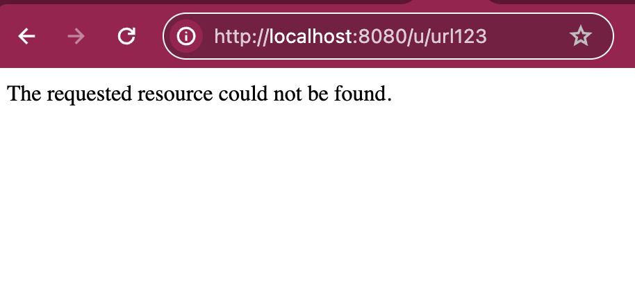
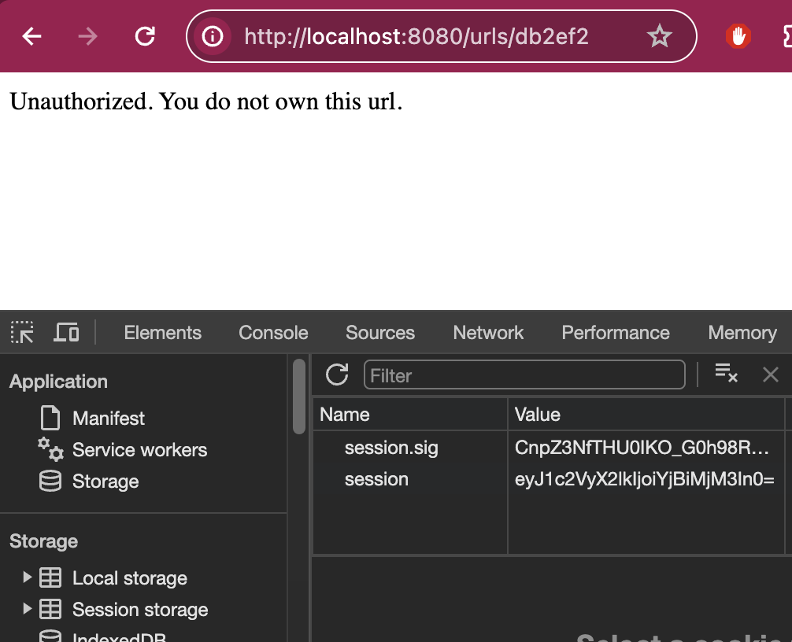

# TinyApp

TinyApp is a full stack Web Application built with Node and Express that allows user to shorten long URLs (à la bit.ly).

## Product Images

* Index

* Register

* Login

* Create TinyURL

* Edit

* Error - Main page, when not logged in

* Error - Login

* Error - Registration

* Error - short url, non existence

* Error - URL unauthorized

## Getting Started
* Install all dependencies, `npm install` command
* Run the development server, `npm start` command - Thanks to Nodemon.
* Go to http://localhost:8080/Register to create a new account. You will be logged in automatically with your newly registered account
* Go to http://localhost:8080/login to login
* You may start creating new shorten or tiny URL with your given long URL.

### Dependencies
* "bcryptjs": "^2.4.3",
* "chai-http": "^4.4.0",
* "cookie-session": "^2.1.0",
* "ejs": "^3.1.9",
* "express": "^4.18.2"
* "chai": "^4.3.1",
* "mocha": "^10.3.0",
* "nodemon": "^3.0.3"

