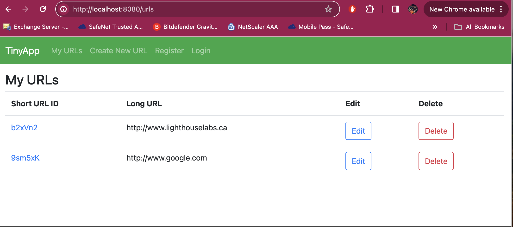

# TinyApp

TinyApp is a full stack Web Application built with Node and Express that allows user to shorten long URLs (à la bit.ly).

## Product Images

* Index

* Register

* Login

* Create TinyURL

* Edit

## Getting Started
* Install all dependencies, `npm install` command
* Run the development server, `npm start` command - Thanks to Nodemon.
* Go to http://localhost:8080/urls to see the index page of the application.
* Go to register menu to create a new account, you will be logged in automatically using your newly registered account.
* You may start creating new shorten or tiny URL with your given long URL (www.google.com)

### Dependencies
* Express
* ejs
* cookie-parser
* nodemon

